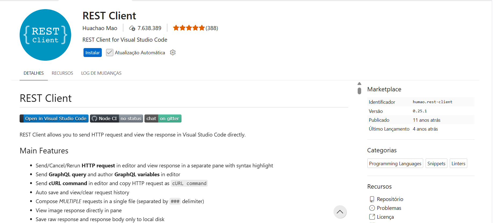

# 07-dwbe-node-http-phr

```bash
sudo apt update
```

```bash
sudo apt install -y nodejs
```

```bash
node -v
```

```bash
npm install -g npm@11.19.0
```

```bash
npm -v
```

```bash
mkdir projeto-node
```

```bash
cd projeto-node
```

```bash
npm init -y
```

No arquivo `package.json`, substituir ` "type": "commonjs"` por ` "type": "module"`:

```text
{
  "name": "projeto-node",
  "version": "1.0.0",
  "description": "",
  "main": "index.js",
  "scripts": {
    "test": "echo \"Error: no test specified\" && exit 1"
  },
  "keywords": [],
  "author": "",
  "license": "ISC",
  "type": "module"
}
```

```bash
node 01-index.js
```

No VS Code, instalar a extensão `REST Client`:




Criar os arquivos `02-index.js` e `02-index.http`.

Conteúdo do arquivo `02-index.http`:

```text
GET http://localhost:3000
```

Criar os arquivos `03-index.js` e `03-index.http`.

Conteúdo do arquivo `03-index.http`:

```text
# Isto é um comentário.
//Isto também é um comentário.

### Isto é um separador de requisições:
GET http://localhost:3000

### Isto é um separador de requisições:
GET http://localhost:3000/

### Isto é um separador de requisições:
GET http://localhost:3000/sobre

### Isto é um separador de requisições:
GET http://localhost:3000/contato

### Isto é um separador de requisições:
GET http://localhost:3000/produtos
```

Criar os arquivos `04-index.js` e `04-index.http`.

Conteúdo do arquivo `04-index.http`:

```text
# Isto é um comentário.
//Isto também é um comentário.

// Variável:
@host = http://localhost:3000

### Isto é um separador de requisições:
GET {{host}}/dados
```

Criar os arquivos `05-index.js` e `05-index.http`.

Conteúdo do arquivo `05-index.http`:

```text
# Isto é um comentário.
//Isto também é um comentário.

// Variável:
@host = http://localhost:3000

### Isto é um separador de requisições:
GET {{host}}/dados
```

Criar os arquivos `06-index.js` e `06-index.http`.

Conteúdo do arquivo `06-index.http`:

```text
# Isto é um comentário.
//Isto também é um comentário.

// Variável:
@host = http://localhost:3000

### Isto é um separador de requisições:
GET {{host}}/dados
```

---

## Exercícios

1.